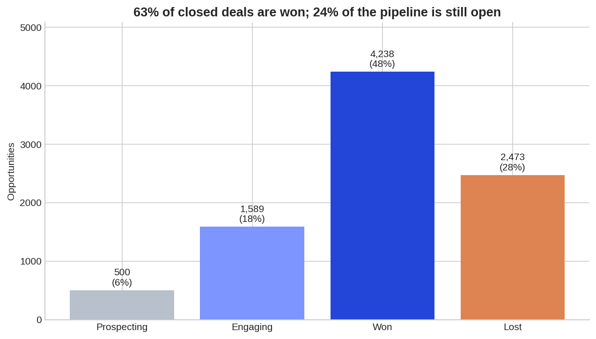
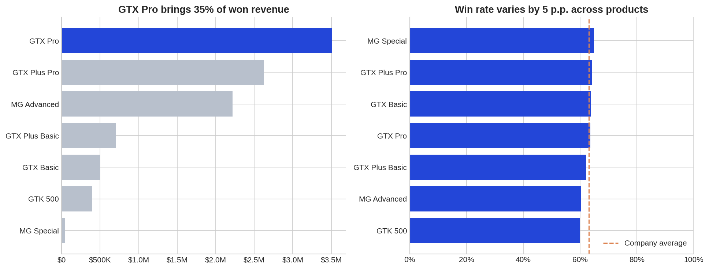
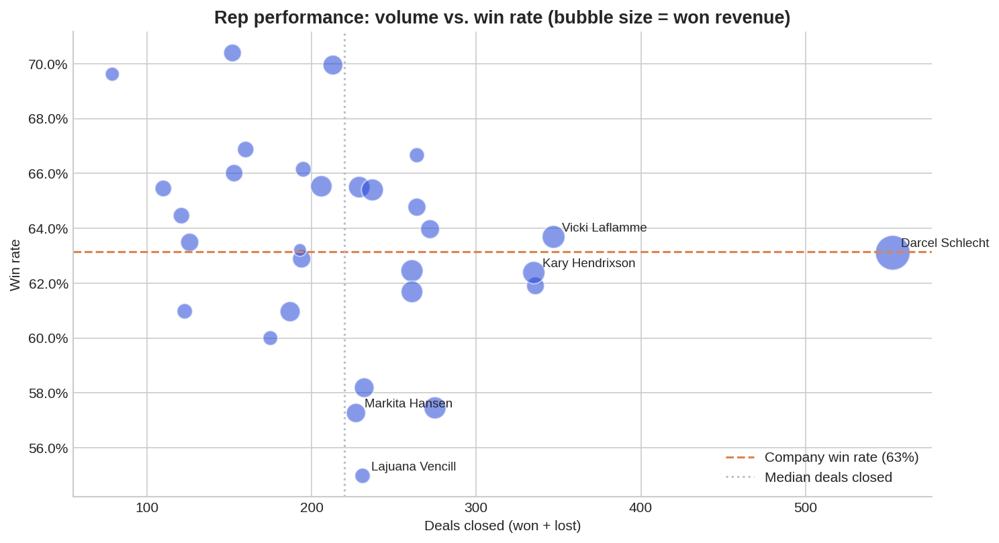
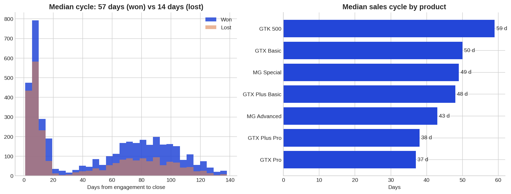
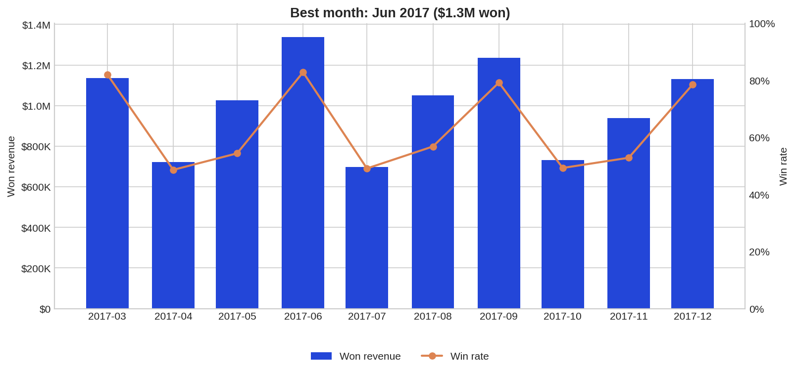
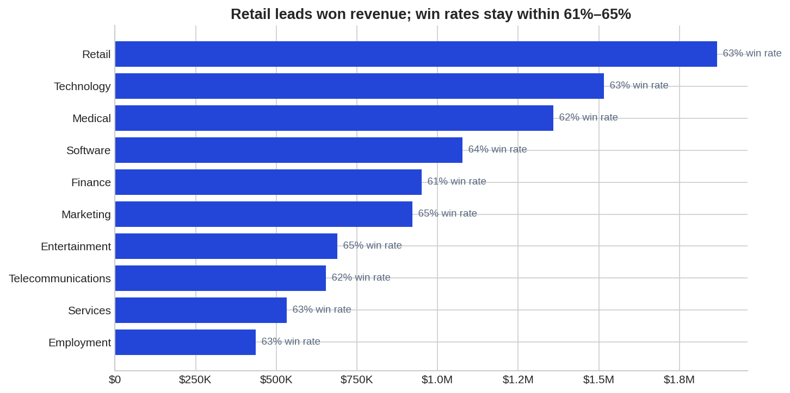

# B2B Sales Pipeline Analysis

**Win rates, sales cycle and rep performance in a B2B CRM — with recommendations for sales leadership.**

[📓 Kaggle notebook](https://www.kaggle.com/code/mutoledo0/sales-pipeline-analysis) · [🌐 Portfolio](https://murilotoledo44-hub.github.io) · [💼 LinkedIn](https://www.linkedin.com/in/murilo-toledoremote)

---

## The problem

A Revenue Operations team needs a reliable read on pipeline health before setting next year's targets. Using a B2B company's CRM data (accounts, products, sales teams and ~8,800 opportunities, Oct 2016 – Dec 2017), I answered five questions a VP of Sales would ask:

1. How healthy is the pipeline, and what is our win rate?
2. Which products win most often, drive revenue and hold their price?
3. How long do deals take to close?
4. How did revenue and win rate move month by month?
5. Which reps, managers and regions over- or under-perform?

## Headline results

| Metric | Value |
|---|---|
| Won revenue | **$10.0M** |
| Win rate (won ÷ closed) | **63.2%** |
| Median sales cycle | **45 days** |
| Stale deals (Engaging > 90 days) | **1,465 — 92% of Engaging** |



## Key findings and recommendations

**1. The open pipeline is not reliable.** 92% of deals in the Engaging stage have been open for more than 90 days — twice the 45-day median cycle. The forecast built on these deals is likely overstated.
→ Flag Engaging deals automatically after 90 days, review them weekly (advance with a dated next step or close as lost), and report the forecast with and without stale deals.

**2. Win rate is not a product problem.** Win rates range only from 60.0% (GTK 500) to 64.8% (MG Special). Meanwhile, GTX Pro alone brings 35% of won revenue.
→ Focus enablement on sales process and qualification rather than product training, and set pipeline targets for second-tier products to reduce dependence on GTX Pro.



**3. Pricing discipline is strong.** Even the product with the lowest price realization (GTX Plus Basic) closes at 98.5% of list price.
→ No new discount-approval steps are needed; keep price realization as a monitored KPI.

**4. Performance gaps are about execution and concentration.** Three high-volume reps win more than 5 p.p. below the company average. The top rep generated $1.15M (11.5% of all won revenue) at a 63% win rate — right at the average, so the result comes from volume and deal selection rather than a higher close rate.
→ Run lost-deal reviews with the three reps, document the top rep's prospecting and deal-selection habits as a playbook, and treat the concentration of revenue in one person as a retention risk.



**5. CRM data quality needs guardrails.** Product names (`GTXPro` vs `GTX Pro`) and sector labels (`technolgy`) were inconsistent across tables, which silently breaks joins and reports.
→ Replace free-text fields with picklists and add validation rules.

## More charts

| Sales cycle | Monthly trend | Sectors |
|---|---|---|
|  |  |  |

## Approach

1. **Data quality audit** — missing values by deal stage, unmatched keys across tables, label typos, duplicates.
2. **Cleaning** — normalized product names and sector labels; kept expected blanks (e.g. no close date on open deals) instead of dropping rows.
3. **Master table** — joined pipeline, teams, products and accounts, with a row-count check to catch bad joins.
4. **Analysis** — KPIs, stage distribution, product mix, price realization, sales cycle, monthly trend, rep/manager/region and sector performance.
5. **Recommendations** — written for a sales leadership audience.

## Tools

Python · pandas · NumPy · Matplotlib · seaborn · Kaggle Notebooks

## Repository structure

```
├── README.md
├── b2b_sales_pipeline_analysis.ipynb
└── charts/
    ├── 01_pipeline_by_stage.png
    ├── 02_products.png
    ├── 03_sales_cycle.png
    ├── 04_monthly_trend.png
    ├── 05_rep_performance.png
    └── 06_sectors.png
```

## How to run

Open the [Kaggle notebook](https://www.kaggle.com/code/mutoledo0/sales-pipeline-analysis) and click **Copy & Edit**, then **Run All**. The dataset is attached as an input. To run locally, download the CSVs from the dataset page into this folder and run the notebook — it finds the files automatically.

## Data

"CRM + Sales + Opportunities" dataset on Kaggle (fictional B2B company data, Oct 2016 – Dec 2017).

---

*Murilo Toledo — moving from outbound sales into Revenue Operations.*
